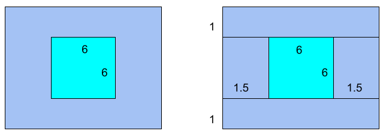

The other day, I started thinking about the areas of squares and rectangles. Specifically, can you cut a square out of the center of a rectangle such that both the square and the remainder have the same area? The remainder of the rectangle must be one contiguous shape; you should end up with exactly two distinct shapes.

A formula follows from this pretty directly. Let the rectangle be x wide and y long, with an area of x * y. We can call the side length of the cut-out square z; the square's area is thus z^2. Given that the areas of the rectangle's remainder and the cut-out square must be equal, it follows that x * y - z^2 = z^2. This simplifies by the following:

x * y - z^2 = z^2

x * y = 2z^2

(x * y)/2 = z^2

sqrt((x * y)/2) = z

Trivially, x, y, and z must all be greater than 0, in order for the shapes to have any area whatsoever. In addition, z must be less than x and y. It is impossible for z to be greater than x or y, as the square is inherently bounded by the rectangle. If z equals x or y, then the remainder of the rectangle, if the square is taken from its middle, would no longer be contiguous.

It is possible to have z equal x or y if we allow the square to be taken from parts of the rectangle other than the center; for instance, say we have x = 10, y = 5, z = 5. The area of the rectangle is 50 sq units, and the area of the square must be 25 sq units. If we take the left half of the rectangle as our square, thus leaving us with two identical squares, the conditions of our problem are satisfied. I find this less interesting than taking the square from the center.

In order to be certain that x and y are greater than z, we must make sure that the rectangle's smaller side (if one exists) is greater than half of its larger side. For a proof of this condition by contradiction, let us say that y >= x, and that x > y/2. If we were to say that x = y/2, then following the formula would give z = sqrt((y * y/2)2) = sqrt(y^2/4) = y/2, meaning z = y/2. This would inherently leave us with a remainder that is not contiguous, meaning that the conditions we accepted for the proof by contradiction are impossible.

Taking into account the above restrictions, we must thus amend our formula to **z = sqrt((x * y)/2); y >= x > y/2 > 0**.

Let's look at some examples. The cleanest set of values I have found thus far is x = 8, y = 9. Following the formula, we have z = sqrt((8 * 9)/2); z = sqrt(72/2); z = sqrt(36); z = 6. If we attempt to visualize this to confirm it, let us picture the cut-out square taken exactly from the center of the rectangle. If we divide the rectangle's remainder into four separate rectangles for the sake of ease of calculation, we are left with two whose dimensions are 1 unit by 9 units and two whose dimensions are 1.5 units by 6 units. This gives a total area of (2 * (1 * 9)) + (2 * (1.5 * 6)) = 18 + 18 = 36, equivalent to that of the square with side length of 6. An illustration is below.



Some significantly less clean values are x = 0.5, y = 0.5. The formula gives z = sqrt((0.5 * 0.5)/2) = sqrt(0.125) ~= 0.3536. The square has an area of 0.125 units. If we divide the rectangle's remainder into four rectangles, we are left with two whose dimensions are 0.5 units by (0.5 - sqrt(0.125))/2 and two whose dimensions are sqrt(0.125) by (0.5 - sqrt(0.125))/2. This gives a total area of roughly 2 * 0.0366 + 2 * 0.0258 ~= 0.1248, equivalent to that of the square with the side length of sqrt(0.125). I'm not making an illustration for this one.

For a simple Python implementation, try:

```python
import math

def cut_out_square_side_length(x: float, y: float) -> float:
    if x <= 0 or y <= 0:
        raise Exception("x and y must be greater than 0.")
    if (y > x and x <= y / 2) or (y < x and y <= x / 2):
        raise Exception("The rectangle's smaller side must be greater than half its larger side.")
    return math.sqrt(x * y / 2)
```